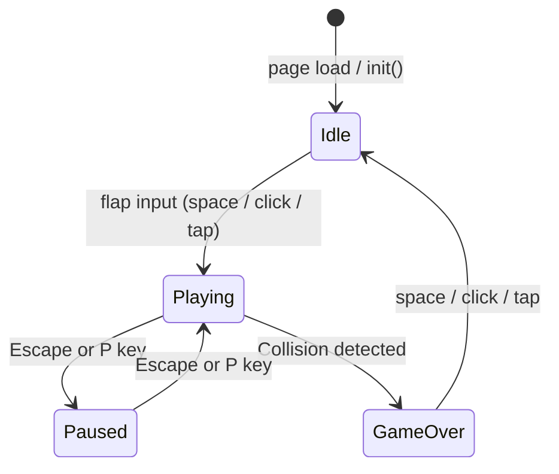

# Design Document — Flappy Kiro

## Overview

Flappy Kiro is a self-contained browser game delivered as a **single HTML file** with no build step, no external dependencies, and no server requirement. The player guides a ghost character ("Ghosty") through an endless series of pipe obstacles by tapping, clicking, or pressing spacebar to flap upward while gravity pulls the ghost down.

The game is driven by a `requestAnimationFrame` loop and rendered entirely on an HTML5 `<canvas>` element. All game logic, rendering, audio, and persistence live inside one file structured as three logical sections: HTML markup, CSS styling, and a JavaScript module.

### Key Design Decisions

- **Single-file delivery**: All code is inlined. Assets (images, audio) are loaded from the `assets/` folder relative to the HTML file. This keeps deployment trivial — just open the file.
- **Canvas-based rendering**: No DOM manipulation during gameplay. Everything is drawn each frame via the 2D Canvas API, giving full control over draw order and visual effects.
- **Fixed-timestep physics with delta-time clamping**: Physics values (gravity, flap velocity) are expressed in pixels-per-frame at 60 fps. A delta-time multiplier is applied each frame so the game stays consistent across different refresh rates, clamped to prevent spiral-of-death on tab-switch.
- **State machine**: Four explicit states (Idle, Playing, Paused, Game Over) with well-defined transitions prevent logic bleed between modes.
- **Graceful audio degradation**: All audio operations are wrapped in try/catch. Missing assets are silently skipped.

---

## Architecture

### Single HTML File Structure

```
index.html
├── <head>
│   └── <style>          ← CSS: body/canvas reset, font import
├── <body>
│   └── <canvas id="gameCanvas">
└── <script type="module">
    ├── Constants         ← Physics, timing, layout magic numbers
    ├── State             ← Mutable game state object
    ├── Asset Loader      ← Image + audio loading with error handling
    ├── Input Handler     ← keydown, click, touchstart listeners
    ├── Physics           ← applyGravity(), applyFlap(), updateGhosty()
    ├── Pipe System       ← spawnPipe(), updatePipes(), checkScore()
    ├── Cloud System      ← initClouds(), updateClouds()
    ├── Collision         ← checkCollision() AABB
    ├── Audio             ← playSound(), startMusic(), pauseMusic()
    ├── Visual Effects    ← screenShake, particles, scorePopups
    ├── Renderer          ← drawBackground(), drawClouds(), drawPipes(),
    │                        drawGhosty(), drawParticles(), drawUI()
    ├── Game Loop         ← gameLoop(timestamp), update(), render()
    └── Init              ← init() entry point
</script>
```

### CSS

The CSS section resets margin/padding on `body` and `html`, sets `overflow: hidden`, and positions the canvas to fill the viewport. A `@font-face` or Google Fonts import provides the monospace/pixel font. No layout work happens in CSS during gameplay.

### JavaScript Module

All game code lives in a single `<script type="module">` block. Using `type="module"` gives strict mode and top-level `const`/`let` scoping without polluting the global namespace. There are no imports — everything is defined inline.

---

## Game State Machine



### State Definitions

| State | Physics | Pipes scroll | Particles | Input accepted |
|-------|---------|-------------|-----------|----------------|
| `IDLE` | Ghosty bobs (sine wave, no gravity) | No | No | Flap → Playing |
| `PLAYING` | Full gravity + flap | Yes | Yes | Flap, Pause |
| `PAUSED` | Frozen | Frozen | No new | Pause toggle |
| `GAME_OVER` | Frozen | Frozen | No new | Restart → Idle |

### State Object

```js
const STATE = {
  IDLE: 'idle',
  PLAYING: 'playing',
  PAUSED: 'paused',
  GAME_OVER: 'game_over',
};
```

A single `state.current` string holds the active state. Transition functions (`toPlaying()`, `toPaused()`, `toGameOver()`, `toIdle()`) encapsulate all side effects (reset positions, start/stop music, clear pipes, etc.).

---

## Components and Interfaces

### Ghosty

```js
{
  x: number,          // fixed horizontal position (≈ 20% of canvas width)
  y: number,          // current vertical centre position
  vy: number,         // vertical velocity (positive = downward)
  width: number,      // sprite render width (e.g. 40px)
  height: number,     // sprite render height (e.g. 40px)
  bobOffset: number,  // sine-wave offset used in Idle state
  bobTime: number,    // accumulator for bob animation (seconds)
}
```

### PipePair

```js
{
  x: number,          // left edge of both pipes
  gapCentreY: number, // vertical centre of the gap
  gapHeight: number,  // fixed gap height (constant per session)
  width: number,      // pipe width (e.g. 52px)
  scored: boolean,    // true once Ghosty has passed this pipe
}
```

Derived values (computed on use, not stored):
- `topPipeBottom = gapCentreY - gapHeight / 2`
- `bottomPipeTop = gapCentreY + gapHeight / 2`

### Cloud

```js
{
  x: number,          // current left edge position
  y: number,          // vertical centre
  width: number,      // cloud width (randomised at spawn)
  height: number,     // cloud height (randomised at spawn)
  layer: 'far' | 'mid' | 'near',
  speed: number,      // pixels/frame (derived from layer)
  opacity: number,    // alpha (derived from layer)
}
```

### Particle

```js
{
  x: number,
  y: number,
  vx: number,         // horizontal drift (slightly negative — trails behind)
  vy: number,         // small random vertical drift
  radius: number,     // 2–5 px
  alpha: number,      // current opacity (starts at 0.7–1.0, decays to 0)
  lifetime: number,   // total lifespan in ms (300–600)
  age: number,        // elapsed ms since spawn
  color: string,      // e.g. 'rgba(200, 200, 255, 1)'
}
```

### ScorePopup

```js
{
  x: number,          // horizontal position (near scored pipe or score bar)
  y: number,          // starting vertical position
  alpha: number,      // current opacity (1.0 → 0.0)
  age: number,        // elapsed ms since spawn
  duration: number,   // total animation duration (800ms)
}
```

---

## Data Models

### Global State Object

```js
const state = {
  current: STATE.IDLE,
  score: 0,
  highScore: 0,
  ghosty: { ...ghostyDefaults },
  pipes: [],          // PipePair[]
  clouds: [],         // Cloud[]
  particles: [],      // Particle[]
  scorePopups: [],    // ScorePopup[]
  pipeSpeed: BASE_PIPE_SPEED,
  lastPipeX: 0,       // x position of most recently spawned pipe's left edge
  shakeOffset: { x: 0, y: 0 },
  shakeDuration: 0,   // remaining shake time in ms
  shakeElapsed: 0,
  newHighScore: false, // flag: did we beat the high score this session?
};
```

### Constants

```js
const GRAVITY            = 0.5;          // px/frame² at 60fps
const FLAP_VELOCITY      = -9;           // px/frame (negative = upward)
const TERMINAL_VELOCITY  = 12;           // px/frame downward cap
const BASE_PIPE_SPEED    = 3;            // px/frame
const MAX_PIPE_SPEED     = 10;           // px/frame
const SPEED_INCREMENT    = 0.5;          // px/frame per milestone
const SCORE_MILESTONE    = 5;            // points between speed increases
const PIPE_SPACING       = 280;          // px between pipe left edges
const GAP_HEIGHT         = 150;          // px
const MIN_GAP_MARGIN     = 40;           // px from top/bottom
const SCORE_BAR_HEIGHT   = 48;          // px
const SHAKE_DURATION     = 400;          // ms
const SHAKE_MAX_DISP     = 8;            // px
const PARTICLE_LIFETIME  = [300, 600];   // ms range
const POPUP_DURATION     = 800;          // ms
const BOB_AMPLITUDE      = 8;            // px
const BOB_FREQUENCY      = 1.5;          // Hz
const CLOUD_LAYERS = {
  far:  { speedMult: 0.2, opacity: 0.25 },
  mid:  { speedMult: 0.5, opacity: 0.45 },
  near: { speedMult: 0.9, opacity: 0.70 },
};
const LS_HIGH_SCORE_KEY  = 'flappyKiro_highScore';
```

---

## Game Loop Design

### Loop Structure

```js
let lastTimestamp = 0;

function gameLoop(timestamp) {
  const rawDelta = timestamp - lastTimestamp;
  lastTimestamp = timestamp;
  // Clamp delta to max 50ms (prevents spiral-of-death on tab switch)
  const delta = Math.min(rawDelta, 50);
  const dt = delta / (1000 / 60); // normalise to 60fps multiplier

  update(dt);
  render();

  requestAnimationFrame(gameLoop);
}
```

`dt` is a dimensionless multiplier: at exactly 60 fps `dt ≈ 1.0`, at 30 fps `dt ≈ 2.0`. All physics values are multiplied by `dt` so the game runs at the same effective speed regardless of frame rate.

### Update Phase

```
update(dt)
  ├── if PLAYING:
  │   ├── updateGhosty(dt)       ← gravity, position, bob=off
  │   ├── updatePipes(dt)        ← scroll, spawn, remove off-screen
  │   ├── checkScore()           ← increment score, spawn popup
  │   ├── checkCollision()       ← AABB test
  │   ├── updateParticles(dt)    ← age, fade, remove expired
  │   ├── updateScorePopups(dt)  ← age, fade, remove expired
  │   └── updateClouds(dt)       ← scroll all layers
  ├── if IDLE:
  │   ├── updateGhostyBob(dt)    ← sine-wave bob
  │   └── updateClouds(dt)
  ├── if PAUSED:
  │   └── (nothing — all frozen)
  └── if GAME_OVER:
      ├── updateScorePopups(dt)  ← let existing popups finish
      └── updateShake(dt)        ← let shake finish
```

### Render Phase

See Rendering Pipeline section below.

---

## Physics System

### Gravity and Flap

```js
function updateGhosty(dt) {
  // Apply gravity
  state.ghosty.vy += GRAVITY * dt;
  // Cap terminal velocity
  if (state.ghosty.vy > TERMINAL_VELOCITY) {
    state.ghosty.vy = TERMINAL_VELOCITY;
  }
  // Update position
  state.ghosty.y += state.ghosty.vy * dt;
}

function applyFlap() {
  state.ghosty.vy = FLAP_VELOCITY; // override, not add
}
```

### Idle Bob

```js
function updateGhostyBob(dt) {
  state.ghosty.bobTime += dt * (1 / 60); // convert dt-frames to seconds
  state.ghosty.y = state.ghosty.baseY
    + Math.sin(state.ghosty.bobTime * BOB_FREQUENCY * 2 * Math.PI)
    * BOB_AMPLITUDE;
}
```

### Physics Values Summary

| Constant | Value | Notes |
|----------|-------|-------|
| `GRAVITY` | 0.5 px/frame² | Applied each frame × dt |
| `FLAP_VELOCITY` | −9 px/frame | Negative = upward |
| `TERMINAL_VELOCITY` | 12 px/frame | Downward cap |
| `BOB_AMPLITUDE` | 8 px | Idle hover range |
| `BOB_FREQUENCY` | 1.5 Hz | Idle hover speed |

---

## Pipe Generation System

### Spawning Logic

A new pipe is spawned when the canvas is first entered into Playing state (immediately off the right edge) and subsequently whenever the gap between the canvas right edge and the last spawned pipe's left edge equals `PIPE_SPACING`.

```js
function updatePipes(dt) {
  // Scroll existing pipes
  for (const pipe of state.pipes) {
    pipe.x -= state.pipeSpeed * dt;
  }

  // Spawn new pipe if needed
  const lastPipe = state.pipes[state.pipes.length - 1];
  const spawnThreshold = lastPipe
    ? lastPipe.x + PIPE_SPACING
    : canvas.width; // first pipe spawns one spacing from right edge

  if (!lastPipe || spawnThreshold <= canvas.width) {
    spawnPipe();
  }

  // Remove off-screen pipes
  state.pipes = state.pipes.filter(p => p.x + p.width > 0);
}
```

### Gap Randomisation Formula

```js
function randomGapCentre() {
  const minY = GAP_HEIGHT / 2 + MIN_GAP_MARGIN;
  const maxY = canvas.height - SCORE_BAR_HEIGHT - GAP_HEIGHT / 2 - MIN_GAP_MARGIN;
  return minY + Math.random() * (maxY - minY);
}
```

This guarantees the gap is always fully visible and reachable regardless of canvas height.

### Speed Progression

```js
function checkSpeedMilestone() {
  if (state.score > 0 && state.score % SCORE_MILESTONE === 0) {
    state.pipeSpeed = Math.min(
      state.pipeSpeed + SPEED_INCREMENT,
      MAX_PIPE_SPEED
    );
  }
}
```

Called once per score increment (guarded by the `scored` flag on each pipe to prevent double-counting).

### Speed Progression Table

| Score | Pipe Speed (px/frame) |
|-------|-----------------------|
| 0 | 3.0 |
| 5 | 3.5 |
| 10 | 4.0 |
| 15 | 4.5 |
| … | … |
| 35+ | 10.0 (capped) |

---

## Parallax Cloud System

### Layer Definitions

```js
const CLOUD_LAYERS = {
  far:  { speedMult: 0.2, opacity: 0.25, count: 4 },
  mid:  { speedMult: 0.5, opacity: 0.45, count: 3 },
  near: { speedMult: 0.9, opacity: 0.70, count: 2 },
};
```

Cloud scroll speed = `BASE_PIPE_SPEED * layer.speedMult`. This means clouds always move proportionally to the base speed but are never affected by the progressive speed increase — the background stays calm even as pipes accelerate.

### Initialisation

On `init()`, clouds are distributed across the canvas width at random x positions. Each cloud is assigned a layer, and its `speed` and `opacity` are derived from the layer definition. Cloud dimensions are randomised within a range (width: 60–160 px, height: 30–60 px).

### Update

```js
function updateClouds(dt) {
  for (const cloud of state.clouds) {
    cloud.x -= cloud.speed * dt;
    // Wrap around: when fully off left edge, reappear off right edge
    if (cloud.x + cloud.width < 0) {
      cloud.x = canvas.width + Math.random() * 100;
      cloud.y = randomCloudY(); // re-randomise vertical position
    }
  }
}
```

Clouds wrap rather than being destroyed and recreated, keeping the cloud count constant.

### Rendering Order Within Clouds

Clouds are drawn in layer order: far first, then mid, then near. This ensures near clouds visually occlude far clouds, reinforcing depth.

---

## Collision Detection

### Approach: AABB (Axis-Aligned Bounding Box)

Ghosty's bounding box is slightly inset from the sprite edges (by ~4 px on each side) to give a forgiving hitbox that matches player perception.

```js
function getGhostyBounds() {
  const inset = 4;
  return {
    left:   state.ghosty.x - state.ghosty.width  / 2 + inset,
    right:  state.ghosty.x + state.ghosty.width  / 2 - inset,
    top:    state.ghosty.y - state.ghosty.height / 2 + inset,
    bottom: state.ghosty.y + state.ghosty.height / 2 - inset,
  };
}

function checkCollision() {
  const g = getGhostyBounds();

  // Screen top/bottom edges
  if (g.top <= 0 || g.bottom >= canvas.height - SCORE_BAR_HEIGHT) {
    triggerCollision();
    return;
  }

  // Pipe AABB test
  for (const pipe of state.pipes) {
    const topPipeBottom  = pipe.gapCentreY - pipe.gapHeight / 2;
    const bottomPipeTop  = pipe.gapCentreY + pipe.gapHeight / 2;
    const pipeLeft       = pipe.x;
    const pipeRight      = pipe.x + pipe.width;

    const horizontalOverlap = g.right > pipeLeft && g.left < pipeRight;
    if (!horizontalOverlap) continue;

    // Top pipe collision
    if (g.top < topPipeBottom) { triggerCollision(); return; }
    // Bottom pipe collision
    if (g.bottom > bottomPipeTop) { triggerCollision(); return; }
  }
}
```

### Collision Trigger

```js
function triggerCollision() {
  state.current = STATE.GAME_OVER;
  playSound('game_over');
  startScreenShake();
  pauseMusic();
  updateHighScore();
}
```

---

## Audio System

### Approach: HTMLAudioElement with graceful degradation

`HTMLAudioElement` is used rather than the Web Audio API for simplicity. Each sound effect is a pre-loaded `Audio` object. For the jump sound, a clone is created on each play to allow rapid re-triggering without waiting for the previous instance to finish.

```js
const sounds = {};

async function loadAudio() {
  const assets = [
    ['jump',       'assets/jump.wav'],
    ['game_over',  'assets/game_over.wav'],
    ['score',      'assets/score.wav'],       // may not exist
    ['music',      'assets/background_music.mp3'], // may not exist
  ];

  for (const [key, src] of assets) {
    try {
      const audio = new Audio(src);
      await new Promise((resolve) => {
        audio.addEventListener('canplaythrough', resolve, { once: true });
        audio.addEventListener('error', resolve, { once: true }); // silent fail
        audio.load();
      });
      sounds[key] = audio;
    } catch {
      // Asset missing or load failed — continue without it
    }
  }
}

function playSound(key) {
  try {
    const src = sounds[key];
    if (!src) return;
    const clone = src.cloneNode();
    clone.play().catch(() => {}); // ignore autoplay policy errors
  } catch { /* silent */ }
}
```

### Background Music

```js
function startMusic() {
  try {
    if (!sounds.music) return;
    sounds.music.loop = true;
    sounds.music.play().catch(() => {});
  } catch { /* silent */ }
}

function pauseMusic() {
  try {
    sounds.music?.pause();
  } catch { /* silent */ }
}

function resumeMusic() {
  try {
    sounds.music?.play().catch(() => {});
  } catch { /* silent */ }
}
```

Music is paused (not stopped) when entering Paused or Game Over states so it resumes from the same position.

### Autoplay Policy Handling

Browsers block audio until a user gesture. The first flap input counts as a user gesture, so `startMusic()` is called inside the flap handler (which fires on click/tap/keydown). This satisfies the browser's autoplay requirement.

---

## Visual Effects

### Screen Shake

The shake effect offsets the entire canvas render by a random displacement each frame, decaying over time.

```js
function startScreenShake() {
  state.shakeDuration = SHAKE_DURATION;
  state.shakeElapsed  = 0;
}

function updateShake(dt) {
  if (state.shakeElapsed >= state.shakeDuration) {
    state.shakeOffset = { x: 0, y: 0 };
    return;
  }
  state.shakeElapsed += dt * (1000 / 60); // convert dt-frames to ms
  const progress  = state.shakeElapsed / state.shakeDuration;
  const intensity = (1 - progress) * SHAKE_MAX_DISP; // linear decay
  state.shakeOffset = {
    x: (Math.random() * 2 - 1) * intensity,
    y: (Math.random() * 2 - 1) * intensity,
  };
}
```

In the render phase, `ctx.translate(shakeOffset.x, shakeOffset.y)` is applied before drawing and `ctx.setTransform(1,0,0,1,0,0)` resets it after.

### Particle Trail

```js
function emitParticle() {
  state.particles.push({
    x:        state.ghosty.x - state.ghosty.width / 2,
    y:        state.ghosty.y + (Math.random() - 0.5) * state.ghosty.height * 0.5,
    vx:       -(Math.random() * 1.5 + 0.5), // drift left
    vy:       (Math.random() - 0.5) * 0.8,
    radius:   Math.random() * 3 + 2,         // 2–5 px
    alpha:    0.8,
    lifetime: PARTICLE_LIFETIME[0]
              + Math.random() * (PARTICLE_LIFETIME[1] - PARTICLE_LIFETIME[0]),
    age:      0,
    color:    'rgba(200, 200, 255, 1)',
  });
}

function updateParticles(dt) {
  const dtMs = dt * (1000 / 60);
  for (const p of state.particles) {
    p.age  += dtMs;
    p.x    += p.vx * dt;
    p.y    += p.vy * dt;
    p.alpha = Math.max(0, 1 - p.age / p.lifetime) * 0.8;
  }
  state.particles = state.particles.filter(p => p.age < p.lifetime);
}
```

### Score Popup

```js
function spawnScorePopup(pipeX) {
  state.scorePopups.push({
    x:        pipeX,
    y:        canvas.height - SCORE_BAR_HEIGHT - 20,
    alpha:    1.0,
    age:      0,
    duration: POPUP_DURATION,
  });
}

function updateScorePopups(dt) {
  const dtMs = dt * (1000 / 60);
  for (const p of state.scorePopups) {
    p.age   += dtMs;
    p.y     -= 0.5 * dt;  // float upward
    p.alpha  = Math.max(0, 1 - p.age / p.duration);
  }
  state.scorePopups = state.scorePopups.filter(p => p.age < p.duration);
}
```

---

## Rendering Pipeline

All drawing happens inside `render()`, called once per frame after `update()`. The draw order ensures correct visual layering:

```
render()
  1. ctx.save() + apply shakeOffset translate
  2. drawBackground()        ← solid light-blue fill + sketchy texture lines
  3. drawClouds('far')       ← far layer, lowest opacity
  4. drawClouds('mid')       ← mid layer
  5. drawClouds('near')      ← near layer, highest opacity
  6. drawPipes()             ← green pipes with darker cap
  7. drawGhosty()            ← sprite image, centred on ghosty.x/y
  8. drawParticles()         ← semi-transparent circles
  9. drawScorePopups()       ← "+1" text with alpha
  10. ctx.restore()          ← undo shake translate
  11. drawScoreBar()         ← dark bar, always at fixed position (no shake)
  12. drawOverlay()          ← state-specific overlay (idle/paused/game-over)
```

The Score Bar and overlays are drawn **after** `ctx.restore()` so they are never affected by screen shake.

### Background Texture

The sketchy background is approximated by drawing a light-blue fill followed by a set of thin, slightly-randomised horizontal and diagonal lines at low opacity (0.05–0.1) using a seeded pattern. The lines are pre-computed once at init and stored as a list of line coordinates to avoid per-frame randomness.

### Pipe Rendering

```js
function drawPipe(x, topY, bottomY, width) {
  const capHeight = 14;
  const capOverhang = 4;

  ctx.fillStyle = '#4caf50';
  // Top pipe body
  ctx.fillRect(x, 0, width, topY - capHeight);
  // Top pipe cap
  ctx.fillStyle = '#388e3c';
  ctx.fillRect(x - capOverhang, topY - capHeight, width + capOverhang * 2, capHeight);

  ctx.fillStyle = '#4caf50';
  // Bottom pipe body
  ctx.fillRect(x, bottomY + capHeight, width, canvas.height - bottomY - capHeight);
  // Bottom pipe cap
  ctx.fillStyle = '#388e3c';
  ctx.fillRect(x - capOverhang, bottomY, width + capOverhang * 2, capHeight);
}
```

---

## Responsive Scaling

### Strategy: Logical Coordinate System

The game uses a **logical resolution** of 480 × 640 (portrait) as its internal coordinate space. All constants (pipe width, gap height, ghosty size, etc.) are expressed in logical pixels. A `scale` factor maps logical pixels to physical canvas pixels.

```js
const LOGICAL_WIDTH  = 480;
const LOGICAL_HEIGHT = 640;

function resizeCanvas() {
  const scaleX = window.innerWidth  / LOGICAL_WIDTH;
  const scaleY = window.innerHeight / LOGICAL_HEIGHT;
  const scale  = Math.min(scaleX, scaleY); // uniform scale, letterbox

  canvas.width  = window.innerWidth;
  canvas.height = window.innerHeight;

  // Store scale for coordinate conversion
  state.scale = scale;
  state.offsetX = (window.innerWidth  - LOGICAL_WIDTH  * scale) / 2;
  state.offsetY = (window.innerHeight - LOGICAL_HEIGHT * scale) / 2;
}
```

All `ctx.drawImage` and `ctx.fillRect` calls use logical coordinates. At the start of each `render()` call, a single `ctx.setTransform(scale, 0, 0, scale, offsetX, offsetY)` is applied so all subsequent drawing is automatically scaled and centred.

Input coordinates (mouse/touch) are converted back to logical space:

```js
function toLogical(clientX, clientY) {
  return {
    x: (clientX - state.offsetX) / state.scale,
    y: (clientY - state.offsetY) / state.scale,
  };
}
```

On `window.resize`, `resizeCanvas()` is called and the canvas transform is updated. No game positions need to change — they are always in logical coordinates.

---

## localStorage Interface

### Key Names

| Key | Type | Description |
|-----|------|-------------|
| `flappyKiro_highScore` | `string` (integer) | Highest score across all sessions |

### Read Operation

```js
function loadHighScore() {
  try {
    const stored = localStorage.getItem(LS_HIGH_SCORE_KEY);
    return stored !== null ? parseInt(stored, 10) : 0;
  } catch {
    return 0; // localStorage unavailable (private browsing, etc.)
  }
}
```

### Write Operation

```js
function saveHighScore(score) {
  try {
    localStorage.setItem(LS_HIGH_SCORE_KEY, String(score));
  } catch {
    // Quota exceeded or unavailable — silently ignore
  }
}
```

Both operations are wrapped in try/catch to handle private browsing mode and storage quota errors gracefully.

### Update Logic

```js
function updateHighScore() {
  if (state.score > state.highScore) {
    state.highScore    = state.score;
    state.newHighScore = true;
    saveHighScore(state.highScore);
  }
}
```

`state.newHighScore` is reset to `false` when transitioning back to Idle.


---

## Correctness Properties

*A property is a characteristic or behavior that should hold true across all valid executions of a system — essentially, a formal statement about what the system should do. Properties serve as the bridge between human-readable specifications and machine-verifiable correctness guarantees.*

### Property Reflection

Before writing the final properties, redundancies in the prework analysis are resolved:

- **4.4 and 5.6 and 11.6** all state "all pipes move by pipeSpeed × dt" — consolidated into one pipe-scrolling property.
- **8.5 and 12.2** both state "update calls while frozen do not change game state" — consolidated into one freeze invariant property parameterised by state.
- **6.2 and 6.3** are both edge cases of the AABB collision property (6.1) — kept as a single combined boundary collision property.
- **13.9 and 13.10** are two halves of the same shake property — merged.
- **13.16 and 13.18** are the same popup expiry property — merged.
- **9.3 and 9.4** are both ordering properties on cloud layers — merged into one cloud parallax ordering property.
- **7.6 (localStorage round-trip)** is a clean standalone property — kept.
- **10.3 (coordinate round-trip)** is a clean standalone property — kept.

After reflection, 12 distinct properties remain.

---

### Property 1: Idle state freezes pipes and score

*For any* number of `update(dt)` calls while `state.current === IDLE`, all pipe x-positions and `state.score` shall remain unchanged.

**Validates: Requirements 2.4**

---

### Property 2: Flap overrides velocity

*For any* current value of `ghosty.vy` (positive, negative, or zero), after `applyFlap()` is called, `ghosty.vy` shall equal exactly `FLAP_VELOCITY` (not `FLAP_VELOCITY + previous_vy`).

**Validates: Requirements 3.4**

---

### Property 3: Gravity accumulates and terminal velocity caps

*For any* initial `ghosty.vy` below `TERMINAL_VELOCITY`, after `updateGhosty(dt)`, `ghosty.vy` shall equal `min(initial_vy + GRAVITY * dt, TERMINAL_VELOCITY)`, and `ghosty.y` shall equal `initial_y + initial_vy * dt`.

**Validates: Requirements 4.1, 4.2, 4.3**

---

### Property 4: Pipes scroll uniformly at pipe speed

*For any* set of active `PipePair` objects with arbitrary x-positions, after `updatePipes(dt)`, every pipe's x shall equal `initial_x − pipeSpeed * dt`, and all pipes shall have moved by the same amount.

**Validates: Requirements 4.4, 5.6, 11.6**

---

### Property 5: Gap centre is always within reachable bounds

*For any* canvas height `H`, every value returned by `randomGapCentre()` shall satisfy:

```
GAP_HEIGHT / 2 + MIN_GAP_MARGIN  ≤  result  ≤  H − SCORE_BAR_HEIGHT − GAP_HEIGHT / 2 − MIN_GAP_MARGIN
```

**Validates: Requirements 5.5**

---

### Property 6: Off-screen pipes are removed

*For any* set of pipes where some have `x + width ≤ 0`, after `updatePipes(dt)`, those pipes shall not appear in `state.pipes`.

**Validates: Requirements 5.8**

---

### Property 7: Speed milestone increases pipe speed, capped at maximum

*For any* score value that is a positive multiple of `SCORE_MILESTONE`, after `checkSpeedMilestone()`, `state.pipeSpeed` shall equal `min(previous_pipeSpeed + SPEED_INCREMENT, MAX_PIPE_SPEED)`. For any score value, `state.pipeSpeed` shall never exceed `MAX_PIPE_SPEED`.

**Validates: Requirements 11.1, 11.4**

---

### Property 8: AABB collision detection is correct for pipes and screen edges

*For any* Ghosty position and pipe configuration where the inset bounding boxes overlap (horizontal and vertical), `checkCollision()` shall trigger a collision. Equivalently, *for any* Ghosty y-position where the top inset bound ≤ 0 or the bottom inset bound ≥ `canvas.height − SCORE_BAR_HEIGHT`, `checkCollision()` shall trigger a collision.

**Validates: Requirements 6.1, 6.2, 6.3**

---

### Property 9: Scoring increments score exactly once per pipe

*For any* pipe where `ghosty.x > pipe.x + pipe.width` and `pipe.scored === false`, after `checkScore()`, `state.score` shall have increased by exactly 1 and `pipe.scored` shall be `true`. Calling `checkScore()` again without moving Ghosty shall not increment the score a second time.

**Validates: Requirements 7.1**

---

### Property 10: High score update and localStorage round-trip

*For any* score value `S > state.highScore`, after `updateHighScore()`, `state.highScore` shall equal `S`. Furthermore, *for any* integer value `V`, `loadHighScore()` called after `saveHighScore(V)` shall return `V`.

**Validates: Requirements 7.5, 7.6**

---

### Property 11: Frozen states do not mutate game physics

*For any* number of `update(dt)` calls while `state.current` is `PAUSED` or `GAME_OVER`, all pipe x-positions, `ghosty.y`, `ghosty.vy`, and `state.particles.length` shall remain unchanged, and `state.current` shall never become `GAME_OVER` from `PAUSED`.

**Validates: Requirements 8.5, 12.2, 12.7**

---

### Property 12: Screen shake displacement is bounded and decays to zero

*For any* elapsed shake time `t ≤ SHAKE_DURATION`, the magnitude of `state.shakeOffset` shall satisfy `√(x² + y²) ≤ SHAKE_MAX_DISP`. After `shakeElapsed ≥ SHAKE_DURATION`, `state.shakeOffset` shall equal `{x: 0, y: 0}`.

**Validates: Requirements 13.9, 13.10**

---

### Property 13: Particle properties are within specified ranges

*For any* particle emitted by `emitParticle()`, `particle.radius` shall be in `[2, 5]` and `particle.lifetime` shall be in `[300, 600]`. *For any* particle where `particle.age ≥ particle.lifetime`, after `updateParticles(dt)`, that particle shall not appear in `state.particles`.

**Validates: Requirements 13.12, 13.14**

---

### Property 14: Score popup fades to zero and is removed after duration

*For any* `ScorePopup` with `duration = 800`, after `popup.age ≥ popup.duration`, `popup.alpha` shall equal `0` and the popup shall not appear in `state.scorePopups`.

**Validates: Requirements 13.16, 13.18**

---

### Property 15: Cloud parallax ordering — nearer layers scroll faster and are more opaque

*For any* two clouds `A` and `B` where `A.layer` is nearer than `B.layer` (near > mid > far), `A.speed > B.speed` and `A.opacity > B.opacity`.

**Validates: Requirements 9.3, 9.4**

---

### Property 16: Coordinate scaling round-trip

*For any* viewport dimensions `(W, H)`, the computed `scale = min(W / LOGICAL_WIDTH, H / LOGICAL_HEIGHT)`, and for any logical coordinate `(lx, ly)`, `toLogical(toPhysical(lx, ly))` shall return `(lx, ly)` (within floating-point tolerance).

**Validates: Requirements 10.3**

---

## Error Handling

### Audio Failures

All audio operations (`new Audio()`, `.play()`, `.pause()`) are wrapped in `try/catch`. A missing or corrupt asset silently sets `sounds[key] = undefined`. All `playSound()` calls check for `undefined` before attempting playback. The game never halts due to audio errors.

### localStorage Failures

`loadHighScore()` and `saveHighScore()` are wrapped in `try/catch`. In private browsing mode or when storage is full, the game falls back to `highScore = 0` and silently skips persistence. The in-memory high score still works correctly within the session.

### Asset Loading Failures

`assets/ghosty.png` is loaded via `new Image()`. If it fails to load, the game falls back to drawing a simple white rectangle as a placeholder sprite. This prevents a blank canvas on asset failure.

### Missing score.wav and background_music.mp3

Both assets are optional. The audio loader treats a load error as a silent skip. The game is fully playable without them.

### Canvas Resize Edge Cases

If `window.innerWidth` or `window.innerHeight` is 0 (e.g., minimised window), `resizeCanvas()` guards against division by zero by defaulting the scale to 1.

### requestAnimationFrame Tab Visibility

When the tab is hidden and then shown, `rawDelta` can be very large (seconds). The 50ms clamp on `delta` prevents physics from jumping forward by many frames at once.

---

## Testing Strategy

### Dual Testing Approach

Both unit tests and property-based tests are used. Unit tests cover specific examples, state transitions, and integration points. Property-based tests verify universal invariants across the full input space.

### Property-Based Testing Library

**[fast-check](https://github.com/dubzzz/fast-check)** (JavaScript/TypeScript) is the chosen PBT library. It integrates with Jest/Vitest and provides rich arbitrary generators for numbers, arrays, and objects.

Each property test runs a minimum of **100 iterations** (fast-check default). For physics properties, 500 iterations are recommended to catch floating-point edge cases.

### Property Test Configuration

Each property test is tagged with a comment referencing the design property:

```js
// Feature: flappy-kiro, Property 3: Gravity accumulates and terminal velocity caps
test('gravity accumulates and terminal velocity caps', () => {
  fc.assert(
    fc.property(
      fc.float({ min: -20, max: 20 }),  // initial vy
      fc.float({ min: 0.5, max: 2.0 }), // dt multiplier
      (initialVy, dt) => {
        state.ghosty.vy = initialVy;
        const initialY = state.ghosty.y;
        updateGhosty(dt);
        expect(state.ghosty.vy).toBeLessThanOrEqual(TERMINAL_VELOCITY);
        if (initialVy < TERMINAL_VELOCITY) {
          expect(state.ghosty.vy).toBeCloseTo(
            Math.min(initialVy + GRAVITY * dt, TERMINAL_VELOCITY), 5
          );
        }
        expect(state.ghosty.y).toBeCloseTo(initialY + initialVy * dt, 5);
      }
    ),
    { numRuns: 500 }
  );
});
```

### Property Tests (one per property)

| Property | Test focus | Arbitraries |
|----------|-----------|-------------|
| P1: Idle freeze | Pipe x and score unchanged | `fc.nat()` (frame count), `fc.array(pipeArb)` |
| P2: Flap overrides velocity | `ghosty.vy === FLAP_VELOCITY` after flap | `fc.float()` (initial vy) |
| P3: Gravity + terminal velocity | vy capped, y updated correctly | `fc.float()` (vy), `fc.float()` (dt) |
| P4: Uniform pipe scrolling | All pipes move by same amount | `fc.array(pipeArb)`, `fc.float()` (dt) |
| P5: Gap centre in bounds | Gap centre within valid range | `fc.integer()` (canvas height) |
| P6: Off-screen pipe removal | Pipes with x+w≤0 removed | `fc.array(pipeArb)` |
| P7: Speed milestone + cap | Speed increases correctly, never exceeds max | `fc.nat()` (score), `fc.float()` (initial speed) |
| P8: AABB collision | Overlapping bounds trigger collision | `fc.record()` (ghosty pos, pipe pos) |
| P9: Score increments once | Score +1, pipe.scored=true, idempotent | `fc.record()` (ghosty x, pipe x/w) |
| P10: High score + localStorage | highScore updated, round-trip | `fc.nat()` (score values) |
| P11: Frozen state invariant | No physics change in PAUSED/GAME_OVER | `fc.nat()` (frame count), `fc.array(pipeArb)` |
| P12: Shake bounded + decays | Offset magnitude ≤ SHAKE_MAX_DISP | `fc.float()` (elapsed time) |
| P13: Particle ranges + cleanup | radius∈[2,5], lifetime∈[300,600], expired removed | `fc.nat()` (particle count) |
| P14: Popup fade + removal | alpha=0 and removed after duration | `fc.float()` (age) |
| P15: Cloud parallax ordering | Nearer layer faster and more opaque | `fc.constantFrom('far','mid','near')` pairs |
| P16: Coordinate round-trip | toLogical(toPhysical(x,y)) === (x,y) | `fc.float()` (viewport dims, coords) |

### Unit Tests

Unit tests cover:
- State transitions: `toPlaying()`, `toPaused()`, `toGameOver()`, `toIdle()` — verify correct `state.current`, reset values, and side effects
- Input handling: spacebar, click, Escape/P key in each state
- Score bar rendering: correct text with current score and high score
- Game over overlay: "Game Over" text, score display, "New High Score!" conditional
- Idle overlay: instructional prompt, high score display
- Paused overlay: "Paused" text, resume prompt
- Audio: mocked `playSound` called with correct keys on flap, collision, score
- localStorage: `loadHighScore()` returns 0 when key absent, returns stored value when present
- Asset failure: game initialises successfully when audio/image load fails

### Test File Structure

```
tests/
├── physics.test.js       ← Properties 2, 3 (gravity, flap, terminal velocity)
├── pipes.test.js         ← Properties 1, 4, 5, 6, 7 (pipe system)
├── collision.test.js     ← Property 8 (AABB)
├── scoring.test.js       ← Properties 9, 10 (score, high score, localStorage)
├── state.test.js         ← Property 11 (frozen states), unit tests for transitions
├── effects.test.js       ← Properties 12, 13, 14 (shake, particles, popups)
├── clouds.test.js        ← Property 15 (parallax ordering)
├── scaling.test.js       ← Property 16 (coordinate round-trip)
└── ui.test.js            ← Unit tests for overlays, score bar, audio mocks
```
